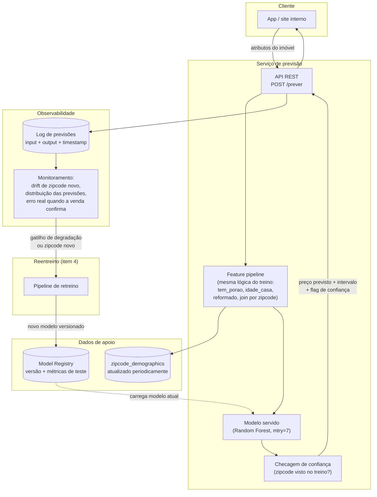

# Estratégia de Deploy

Esse desenho não foi implementado — é o que eu proporia para colocar o modelo (`models/modelo_rf.rds`, Random Forest treinado no item 2.1, [`analysis/02-1_modelagem.qmd`](../analysis/02-1_modelagem.qmd)) em produção, dimensionado para o problema real: um volume de tráfego provavelmente baixo (previsão de preço de imóvel não é um evento de alta frequência) e um modelo que já sei, pelos meus próprios testes de generalização (item 2.2), onde é mais fraco.

## Diagrama

## As camadas, e por que decidi cada uma assim

### 1. Feature pipeline — a parte que mais me preocupa

O maior risco de bug em produção não é o modelo em si, é a lógica de feature engineering ser reescrita de um jeito ligeiramente diferente do notebook de treino (*training-serving skew*). Como `tem_porao`, `idade_casa` e `reformado` são derivadas com regras específicas que eu defini na EDA e na modelagem — inclusive a decisão nada óbvia de qual ano usar como referência para `idade_casa` quando não há data de venda (item 2.3) —, eu encapsularia essa lógica numa única função/pacote compartilhado entre o notebook de treino e o serviço de produção, em vez de reimplementá-la duas vezes. Um teste automatizado comparando a saída dessa função contra um conjunto fixo de exemplos (*golden set*) evitaria que uma mudança futura quebrasse essa paridade silenciosamente.

### 2. API

Um endpoint REST simples (`POST /prever`), recebendo os atributos brutos do imóvel e devolvendo:
- o preço previsto (já revertido de `log_price` para dólar via `exp()`);
- um intervalo de confiança, usando a mesma lógica de bootstrap que já validei no item 2.2 (RMSE de teste com IC 95%) — em vez de devolver só um número solto;
- uma **flag de confiança baixa** quando o `zipcode` do imóvel não estiver entre os que o modelo viu no treino. Essa flag não é genérica — é a tradução direta do achado mais importante do item 2.2: o modelo erra 16% mais em CEPs novos, contra 7% no split temporal. Sinalizar isso no nível da própria resposta da API é mais útil do que só monitorar de longe.

### 3. Infraestrutura

Um container com o modelo serializado (carregado do Model Registry na inicialização, não reempacotado a cada deploy de código) atrás de um serviço gerenciado simples (ex.: Cloud Run / ECS Fargate) com autoscaling básico. Não vejo justificativa para Kubernetes aqui — o volume de dados (~21 mil imóveis históricos, uma predição por vez) não pede a complexidade operacional de um cluster próprio; a decisão de manter a infraestrutura simples é proporcional ao tamanho real do problema, não uma limitação técnica.

### 4. Versionamento de modelo

Cada modelo treinado é salvo com um identificador (data + hash do commit do pipeline de treino + as métricas de teste das três estratégias de validação do item 2.2, não só uma). O "modelo em produção" é um ponteiro/alias para uma dessas versões no registro — trocar de modelo é trocar o alias, o que permite rollback imediato se algo em produção destoar do que os testes indicaram.

### 5. Monitoramento

Priorizei métricas que já sei, pelos meus próprios testes, que são as que importam para este modelo especificamente, em vez de uma lista genérica:
- **% de previsões em CEPs fora do conjunto de treino** — sinal de alerta direto, ligado ao maior risco de generalização que encontrei.
- **Distribuição das previsões vs. distribuição de treino** — a mesma checagem de sanidade que já fiz manualmente no item 2.3, rodando continuamente.
- **Erro real vs. previsto**, assim que o preço de venda for confirmado (com o atraso natural que isso tem no mercado imobiliário) — comparado contra o intervalo de confiança que já calculei, não contra um limiar arbitrário.
- Métricas técnicas padrão (latência, taxa de erro da API) — necessárias, mas não é onde a parte de ciência de dados desse projeto agrega mais valor.
