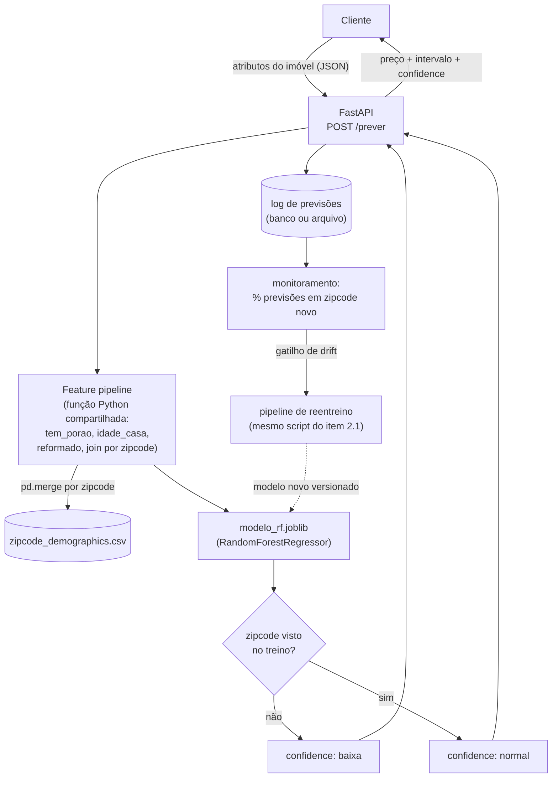

# Estratégia de Deploy (stack Python)

Mesma arquitetura proposta em [`docs/03_estrategia_deploy.md`](../docs/03_estrategia_deploy.md) — a decisão de design não muda com a linguagem. O que muda aqui é a ferramenta concreta de cada camada, trocando o stack R (plumber/caret) pelo equivalente Python (FastAPI/scikit-learn), já que o modelo desta pasta foi treinado com `RandomForestRegressor`.

## Diagrama

## O que muda de ferramenta, camada por camada

| Camada | Proposta em R | Proposta em Python |
|---|---|---|
| Feature pipeline | Função R compartilhada entre `.qmd` e serviço | Módulo Python (`features.py`) importado tanto pelo notebook de treino quanto pela API — mesmo princípio: uma implementação só, nunca duas |
| Modelo servido | `models/modelo_rf.rds` (`saveRDS`/`readRDS`) | `python/models/modelo_rf.joblib` (`joblib.dump`/`joblib.load`) |
| API | `plumber` (R) | **FastAPI** — tipagem de request/response via `pydantic`, o que já documenta o contrato da API automaticamente (`/docs` gerado sozinho) |
| Infraestrutura | Container + serviço gerenciado (Cloud Run/ECS Fargate) | Igual — um container Python (`uvicorn` servindo a FastAPI) no mesmo tipo de serviço gerenciado; a escolha de infraestrutura não depende da linguagem do modelo |
| Versionamento | Alias no Model Registry apontando pro `.rds` | Mesmo conceito, apontando pro `.joblib`; o próprio `joblib` grava metadados de versão do scikit-learn dentro do arquivo, o que ajuda a evitar o erro clássico de carregar um modelo serializado numa versão de biblioteca incompatível |
| Monitoramento | % de previsões em CEP novo, distribuição das previsões, erro real vs. IC | Idêntico — a lógica de monitoramento não é específica de linguagem, é específica do que o item 2.2 (generalização) já provou ser o ponto fraco do modelo |

## Um detalhe técnico específico do Python que vale registrar

O `RandomForestRegressor` do scikit-learn, sem limite de profundidade, gera um arquivo serializado **muito maior** que o equivalente em R (467MB sem restrição, contra os ~44MB do R) — porque por padrão o scikit-learn deixa cada folha crescer até ter uma única observação (`min_samples_leaf=1`), enquanto o `randomForest` do R já limita isso por padrão (`nodesize=5`). Apliquei essa mesma restrição (`min_samples_leaf=5`) no treino Python, reduzindo o modelo para ~25MB com perda de acurácia desprezível. Isso importa pra produção: um modelo desnecessariamente grande aumenta o tempo de cold start do container e o custo de armazenamento no Model Registry, sem ganho real de qualidade.
