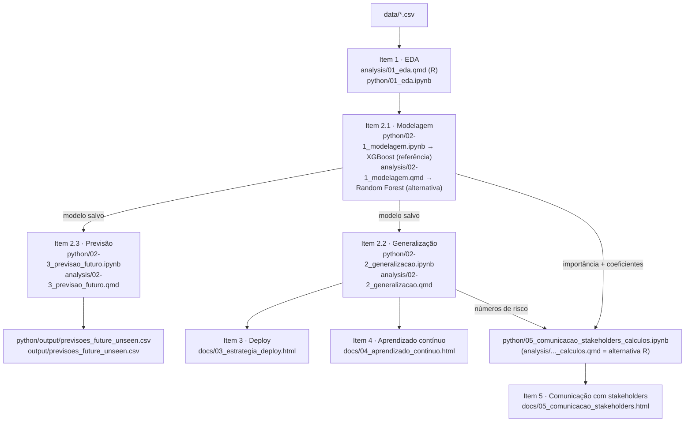

# Guia do Pipeline

Este documento não é um changelog — é o mapa de como os dados viram um modelo em produção e um relatório de negócio, e onde encontrar cada etapa no repositório. A numeração segue os "Entregáveis Esperados" do [`README.md`](README.md) (itens 1 a 5); quando um item foi dividido em mais de um arquivo, uso sub-numeração decimal (2.1, 2.2, 2.3).

**Duas implementações, uma referência.** O projeto tem uma versão em R (`analysis/`) e uma em Python (`python/`). Comecei em R; depois de comparar 6 modelos e confirmar, na versão Python, que XGBoost generaliza melhor que Random Forest (inclusive em bairros nunca vistos no treino), adotei **Python como implementação de referência** — é dali que os itens 3, 4 e a versão apresentável do item 5 seguem. A versão R fica completa e documentada como implementação alternativa igualmente validada, com Random Forest. Cada pasta tem seu próprio `README.md` explicando seu papel: [`analysis/README.md`](analysis/README.md) (R, alternativa) e [`python/README.md`](python/README.md) (Python, referência).

## Estrutura de pastas

```
data/         dados brutos fornecidos (kc_house_data.csv, zipcode_demographics.csv, future_unseen_examples.csv)
analysis/     implementação R — item 1 (EDA) + item 2 alternativo (Random Forest) + item 5 alternativo
python/       implementação de referência — item 1 (EDA) + item 2 (XGBoost) + item 5 (cálculos)
docs/         entregáveis finais dos itens 3, 4 e 5 — seguem o modelo de referência, não são específicos de linguagem
models/       modelos R salvos: modelo_rf.rds (usado pela versão alternativa) e modelo_xgb.rds (comparação, evidência)
output/       previsões da versão R (item 2.3) sobre future_unseen_examples.csv — equivalente a python/output/
```

## O pipeline, etapa por etapa



| Etapa | Item | Roda sobre | Arquivo (referência, Python) | Arquivo (alternativa, R) | Produz |
|---|---|---|---|---|---|
| Análise exploratória | 1 | dados brutos | `python/01_eda.ipynb` | `analysis/01_eda.qmd` | decisões de feature engineering |
| Modelagem | 2.1 | dados + features | `python/02-1_modelagem.ipynb` | `analysis/02-1_modelagem.qmd` | `python/models/{modelo_xgb,modelo_rf}.joblib` e `models/{modelo_rf,modelo_xgb}.rds` — os 2 modelos mais fortes de cada lado, não só o escolhido |
| Generalização | 2.2 | modelo salvo | `python/02-2_generalizacao.ipynb` | `analysis/02-2_generalizacao.qmd` | números de risco (temporal, CEP novo) |
| Previsão em dados novos | 2.3 | modelo salvo | `python/02-3_previsao_futuro.ipynb` | `analysis/02-3_previsao_futuro.qmd` | `python/output/previsoes_future_unseen.csv` e `output/previsoes_future_unseen.csv` |
| Estratégia de deploy | 3 | modelo + generalização | `docs/03_estrategia_deploy.html` | — (diferenças em `python/03_estrategia_deploy.md`) | diagrama de arquitetura |
| Aprendizado contínuo | 4 | generalização | `docs/04_aprendizado_continuo.html` | — | ciclo de reentreino |
| Comunicação com stakeholders | 5 | modelo + generalização | `docs/05_comunicacao_stakeholders.html`, calculado em `python/05_comunicacao_stakeholders_calculos.ipynb` | `analysis/05_comunicacao_stakeholders_calculos.qmd` (números diferentes, roda sobre RF) | relatório de negócio |

Os itens 3, 4 e 5 (pasta `docs/`) são artefatos de apresentação — descrevem o modelo de referência (XGBoost) e não têm uma "versão R" própria, exceto o item 5, que tem uma bancada de cálculo alternativa em R para quem quiser comparar os números sob a Random Forest.

## Como reproduzir do zero

```bash
# 1. R — EDA + implementação alternativa (Random Forest)
quarto render analysis/01_eda.qmd
quarto render analysis/02-1_modelagem.qmd
quarto render analysis/02-2_generalizacao.qmd
quarto render analysis/02-3_previsao_futuro.qmd
quarto render analysis/05_comunicacao_stakeholders_calculos.qmd

# 2. Python — implementação de referência (XGBoost); rode nesta ordem, cada notebook depende do anterior
cd python
python3 -m pip install -r requirements.txt
python3 -m nbconvert --to notebook --execute --inplace 01_eda.ipynb
python3 -m nbconvert --to notebook --execute --inplace 02-1_modelagem.ipynb          # salva models/modelo_xgb.joblib
python3 -m nbconvert --to notebook --execute --inplace 02-2_generalizacao.ipynb      # usa o modelo salvo acima
python3 -m nbconvert --to notebook --execute --inplace 02-3_previsao_futuro.ipynb    # usa o modelo salvo acima
python3 -m nbconvert --to notebook --execute --inplace 05_comunicacao_stakeholders_calculos.ipynb  # usa o modelo salvo acima
```

Requisitos: **R** (4.x) + [Quarto](https://quarto.org/) com `tidyverse`, `janitor`, `skimr`, `corrplot`, `GGally`, `car`, `moments`, `scales`, `patchwork`, `lubridate`, `randomForest`, `caret`, `glmnet`, `xgboost`; **Python** (3.12), ver `python/requirements.txt`.

Os itens 3, 4 e 5 (`docs/`) são páginas HTML estáticas escritas à mão sobre os números já calculados nas etapas acima — não têm um passo de "render" próprio.

## Decisões-chave (resumo — números completos em cada notebook)

- **Target**: `log(price)`, por causa da assimetria forte da distribuição bruta (ver item 1).
- **Modelo de referência**: XGBoost, escolhido em `python/02-1_modelagem.ipynb` e confirmado em `python/02-2_generalizacao.ipynb` (a vantagem sobre Random Forest sobrevive à validação mais rigorosa: CV agrupada por CEP).
- **Maior risco de generalização**: bairro (CEP) nunca visto no treino, não deriva temporal — é o que guia a flag de confiança no item 3 e o gatilho de reentreino mais sensível no item 4.
- **Duas implementações permanecem no repositório por design**: a R não foi descartada após a troca de modelo — fica documentada como alternativa validada, útil para comparação.

## Onde encontrar cada entregável do desafio original

| # | Entregável (`README.md`) | Onde está |
|---|---|---|
| 1 | Análise e entendimento dos dados | `analysis/01_eda.qmd` / `python/01_eda.ipynb` |
| 2a–c | Variáveis importantes, escolha do modelo, generalização | `python/02-1_modelagem.ipynb`, `python/02-2_generalizacao.ipynb` |
| 3 | Estratégia de deploy | `docs/03_estrategia_deploy.html` |
| 4 | Aprendizado contínuo | `docs/04_aprendizado_continuo.html` |
| 5 | Comunicação com stakeholders | `docs/05_comunicacao_stakeholders.html` |
